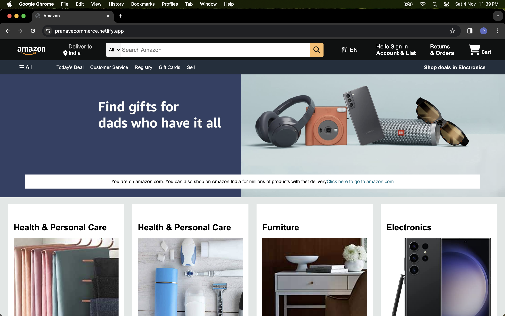
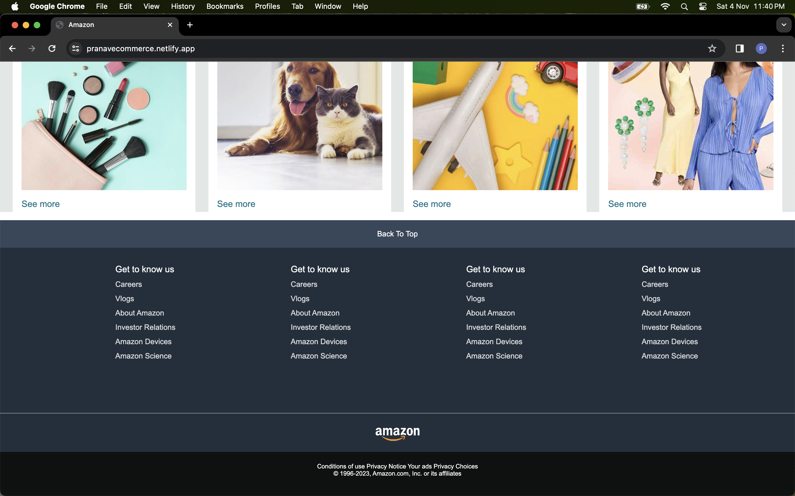

# Amazon Clone

This project is an HTML and CSS clone of the Amazon home page, designed as a single-page application. It aims to replicate the look and feel of Amazon's homepage, providing a practical exercise in web development and design.

## Features

- **Amazon-Styled Layout**: The app mimics the layout and styling of the Amazon homepage, offering a realistic look.

- **Single-Page Design**: This project is a single-page application, showcasing how to create a complete web page with HTML and CSS.

- **Responsive Design**: The clone is built with a responsive design, ensuring it works well on various screen sizes.

## Usage

To view this Amazon clone, simply clone or download the repository to your local machine and open the `index.html` file in your web browser.

## Technologies Used

- HTML
- CSS

## Project Structure

- `index.html`: The main HTML file that represents the Amazon clone page.
- `styles.css`: The CSS file used for styling the page.

## Screenshots

## Author

- Pranav Chauhan

## License

This project is open-source under the [MIT License](LICENSE).
